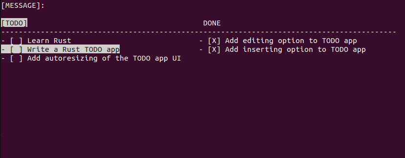

# ToDors

A terminal based Todo list manager written in Rust. My first Rust project.



## Quick Start

```bash
cargo run
```

## Controls

| Key                                                 | Descritption                         |
|-----------------------------------------------------|--------------------------------------|
| <kbd>k/↑</kbd>,<kbd>j/↓</kbd>                       | Move UP/DOWN                         |
| <kbd>SHIFT+k</kbd>,<kbd>SHIFT+j</kbd>               | Drag item UP/DOWN                    |
| <kbd>g</kbd>,<kbd>G</kbd>                           | Jump to START/END of the list        |
| <kbd>d</kbd>                                        | Delete 'Done' item                   |
| <kbd>i</kbd>                                        | Insert a new 'Todo' item             |
| <kbd>a</kbd>                                        | Add subtask to current 'Todo' item   |
| <kbd>u</kbd>                                        | Undo last action                     |
| <kbd>r</kbd>                                        | Edit current item                    |
| <kbd>ENTER</kbd>                                    | Transfer element/Save edited item    |
| <kbd>TAB</kbd>                                      | Switch between 'Todos'/'Dones'       |
| <kbd>ESC</kbd>                                      | Cancel editing                       |
| <kbd>q</kbd>,<kbd>CTRL+c</kbd>                      | Quit                                 |
